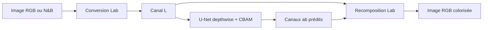

# Colorisation d'images par réseau de neurones

Projet personnel de colorisation d'images noir et blanc. Un U-Net léger avec attention CBAM reçoit le canal de luminance `L` et prédit les canaux chromatiques `a,b` dans l'espace Lab.

> Les couleurs produites sont plausibles. Une image noir et blanc ne contient pas assez d'information pour garantir les couleurs historiques d'origine.

## Architecture



Le dépôt contient aussi un discriminateur PatchGAN et une perte LPIPS. Le checkpoint portfolio `unet_colorization_119.pt` est un artefact historique entraîné avant la correction du chemin de gradient GAN/LPIPS. Il ne doit pas être présenté comme un modèle réentraîné avec cette correction.

## Installation Windows

Pré-requis : pilote NVIDIA récent, `uv`, environ 5 Go libres pour l'environnement CUDA.

```powershell
uv python install 3.11
uv venv .venv --python 3.11
.\.venv\Scripts\Activate.ps1
uv pip install --index-strategy unsafe-best-match -r requirements.txt
python check_environment.py --checkpoint checkpoints\unet_colorization_119.pt
```

Pour reproduire exactement l'environnement validé, utiliser `requirements.lock.txt`
à la place de `requirements.txt`, avec le même paramètre `--index-strategy unsafe-best-match`.

L'environnement validé utilise Python 3.11, PyTorch 2.7.0 et CUDA 12.8 sur une RTX 3060 Laptop 6 Go.

## Checkpoint portfolio

Le modèle n'est pas stocké dans Git. La release [`v1.0.0-portfolio`](https://github.com/Noe-Briffa/image-colorization-nn/releases/tag/v1.0.0-portfolio) contient uniquement l'artefact à télécharger :

```text
unet_colorization_119.pt
```

Placer le fichier téléchargé dans `checkpoints/`.

SHA-256 attendu : `1717d1f6fde0b0657ab0dbf451a13ebdb13d9828a20eac52654356febdb21fc3`.

## Démo Gradio

```powershell
python app.py --checkpoint checkpoints\unet_colorization_119.pt
```

Ouvrir ensuite `http://127.0.0.1:7860`. L'interface permet de déposer une image, régler la saturation et comparer entrée/résultat.

## Inférence en ligne de commande

```powershell
python YT\inference_colorize.py `
  --input in_bw `
  --output artifacts\inference `
  --checkpoint checkpoints\unet_colorization_119.pt `
  --device auto
```

Options principales : `--features 48`, `--max-size 1024`, `--saturation 1.2`, `--device auto|cuda|cpu`.

## Évaluation indépendante

Le protocole V1 sélectionne de façon déterministe 100 images du LMDB test avec la seed 42. Il exporte PSNR, SSIM, DeltaE, LPIPS, les indices évalués et six comparaisons.

```powershell
python evaluate.py `
  --dataset dataset\dataset_lab_imagenet256_test.lmdb `
  --checkpoint checkpoints\unet_colorization_119.pt `
  --max-samples 100 `
  --seed 42 `
  --output artifacts\evaluation
```

Les anciens CSV sont des mesures prises pendant entraînement. Ils ne remplacent pas cette évaluation tenue à part.

## Visuels portfolio

La sélection de comparaisons entrée / prédiction / référence est disponible dans [`docs/PORTFOLIO_ASSETS.md`](docs/PORTFOLIO_ASSETS.md).

## Vidéo portfolio

La vidéo présente le projet comme un travail de Computer Vision : prétraitement en espace Lab, U-Net avec attention CBAM, inférence locale et évaluation indépendante sur 100 images avec la seed 42. Elle montre deux sorties choisies dans cette évaluation, les indices 32 et 95, sous forme de triptyques entrée / prédiction / référence, puis les métriques moyennes PSNR 23.2869, SSIM 0.9402 et DeltaE 14.8435.

Le checkpoint portfolio reste un artefact historique entraîné avant la correction du chemin de gradient GAN/LPIPS ; cette correction prépare une future V2 et ne doit pas être présentée comme ayant modifié le modèle distribué.

La limite présentée dans la vidéo est la suivante : plusieurs colorisations peuvent être plausibles pour une même image. Les images utilisées dans la vidéo et les visuels portfolio doivent être contrôlées avant diffusion publique afin de confirmer leurs droits de réutilisation.

Le guide réutilisable pour préparer et contrôler les prochaines vidéos est disponible dans [`docs/VIDEO_GUIDELINES.md`](docs/VIDEO_GUIDELINES.md).

## Entraînement futur

La V1 portfolio ne relance pas l'entraînement. La commande suivante prépare une V2 avec conversion Lab→RGB différentiable, checkpoints complets et reprise explicite :

```powershell
python main.py `
  --dataset dataset\dataset_lab_imagenet256.lmdb `
  --test-dataset dataset\dataset_lab_imagenet256_test.lmdb `
  --epochs 130 `
  --batch-size 16 `
  --device cuda
```

Pour reprendre : ajouter `--resume checkpoints\unet_colorization_42.pt`.

## Données et publication

Datasets ImageNet, LMDB, checkpoints intermédiaires, environnements, sorties et vidéos restent hors Git. Les six comparaisons générées dans `artifacts/evaluation/` doivent être contrôlées avant publication ; seules les images dont les droits de diffusion sont établis peuvent être copiées dans les visuels portfolio.

## Tests

```powershell
python -m pytest -q
python -m py_compile main.py app.py evaluate.py check_environment.py unet_learning.py YT\inference_colorize.py
```
