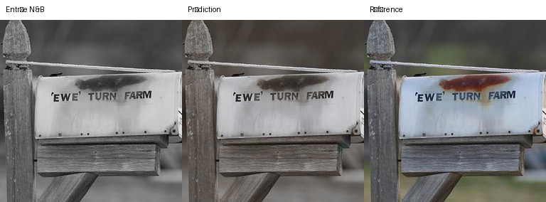
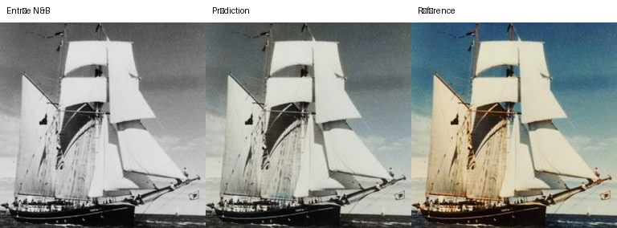
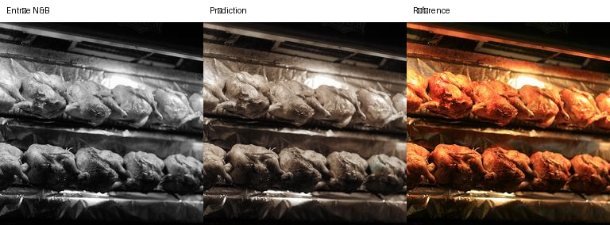
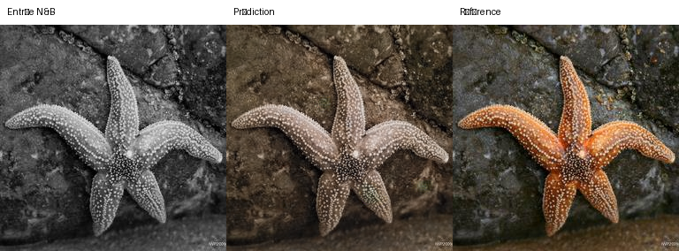
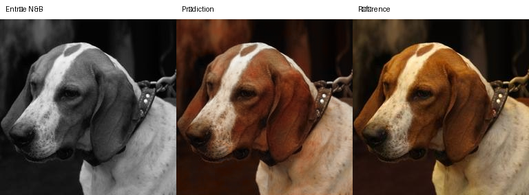
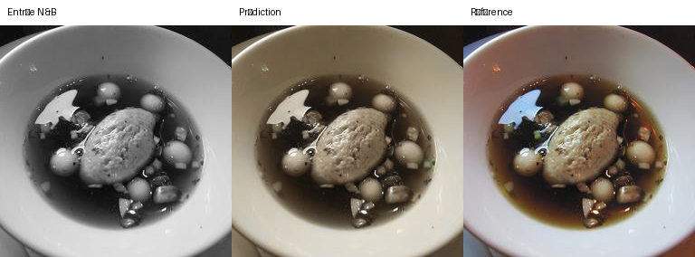

# Visuels portfolio

Sélection de six comparaisons issues de l'évaluation indépendante V1.

Protocole : checkpoint historique `unet_colorization_119.pt`, échantillon déterministe de 100 images du test LMDB, seed 42.

Résultats moyens sur ces 100 images : PSNR 23,2869 · SSIM 0,9402 · DeltaE 14,8435 · LPIPS 0,1938.

Les images montrent respectivement l'entrée noir et blanc, la prédiction du modèle et la référence couleur. Elles illustrent des couleurs plausibles ; elles ne constituent pas une preuve de restitution historique exacte.

## Comparaisons

### Index 6

### Index 25

### Index 27

### Index 30

### Index 32

### Index 44

