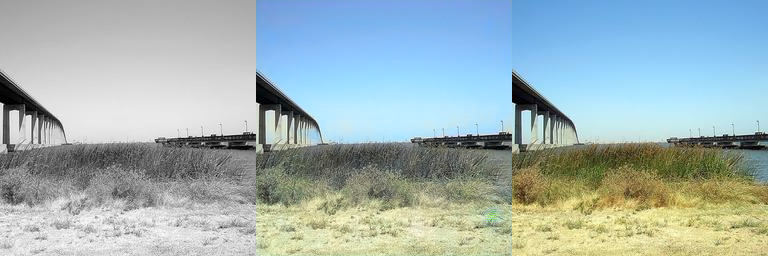

# Visuels portfolio

Sélection de deux comparaisons utilisées dans la vidéo portfolio.

Protocole : checkpoint historique `unet_colorization_119.pt`, échantillon déterministe de 100 images du test LMDB, seed 42.

Résultats moyens sur ces 100 images : PSNR 23,2869 · SSIM 0,9402 · DeltaE 14,8435 · LPIPS 0,1938.

Les deux exemples ont été retenus après classement des sorties par métriques, puis vérification visuelle : indices 32 et 95. Chaque fichier est un triptyque sans texte incrusté. La vidéo ajoute les libellés `Entrée N&B`, `Prédiction` et `Référence couleur` avec du HTML/CSS. La référence couleur sert à comparer la sortie au jeu de test ; elle ne garantit pas la couleur historique d'origine.

Les images de démonstration et les visuels portfolio doivent être contrôlés avant diffusion publique afin de confirmer leurs droits de réutilisation.

## Comparaisons utilisées dans la vidéo

### Index 32

### Index 95

## Archives brutes

Les fichiers `comparison_01_idx6.png` à `comparison_06_idx44.png` restent conservés comme sorties historiques de l’évaluation. Ils ne sont pas utilisés par la vidéo V3.
